# Periscribe — 설계 흐름 문서 (E2EE / 디바이스 수명주기)

> 개발용 설계 문서. 컴포넌트 구조 · 핵심 로직(키/DEK) · 시나리오별 시퀀스 · 상태도 · 데이터 모델.
> 다이어그램은 [Mermaid](https://mermaid.js.org). GitHub·VS Code(Markdown Preview Mermaid)에서 렌더됨.
> 즉시 보려면 같은 폴더의 `design-flows.html`을 브라우저로 열면 됨.
>
> 범례: ✅ 구현됨(커밋 `e8924e5`) · 🟡 제안(미확정)

---

## 1. 컴포넌트 구조 (Context)

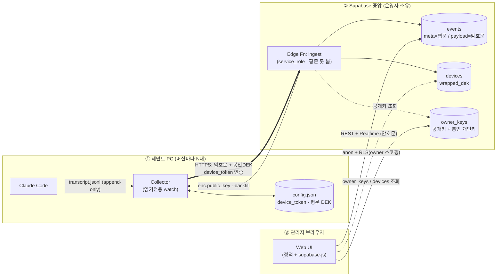

핵심 원칙: **평문 키도 평문 payload도 중앙 서버를 통과하지 않는다.** 암호화는 Collector(쓰기)에서, 복호화는 브라우저(읽기)에서만.

---

## 2. 핵심 로직: 어떻게 DEK가 생기고, 공개키를 가져오나 ✅

per-device DEK는 **머신에서 랜덤 생성**되고, owner **공개키**는 **하트비트 응답**으로 받아온다. 패스프레이즈는 컬렉터에 전혀 안 들어간다.

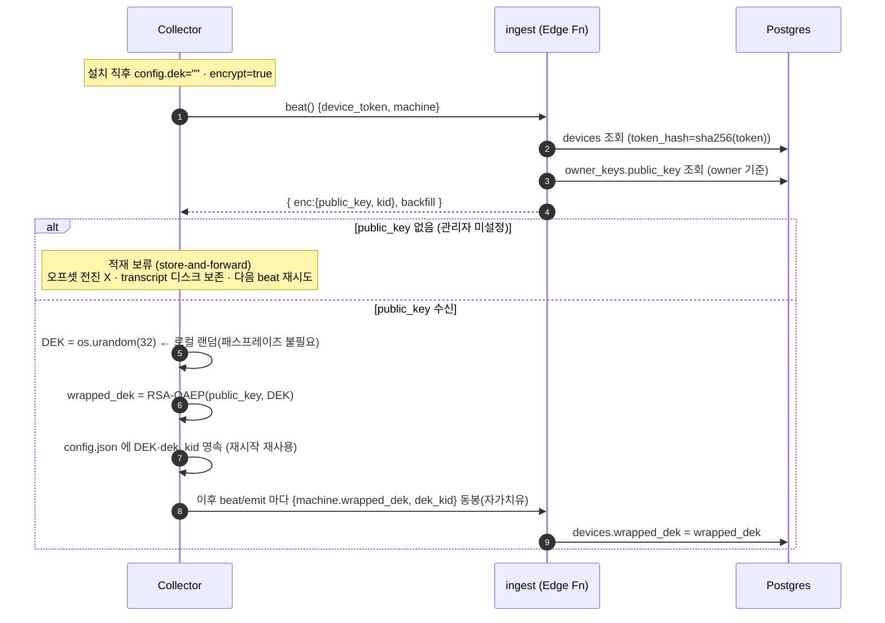

> 코드: `collector/periscribe/collector.py:_handle_enc` · `crypto.py:gen_dek/wrap_dek_rsa` · `sink.py:_refresh_wrapped` · `functions/ingest/index.ts`

### 2.1 관리자 키 셋업 / 잠금해제 (웹) ✅

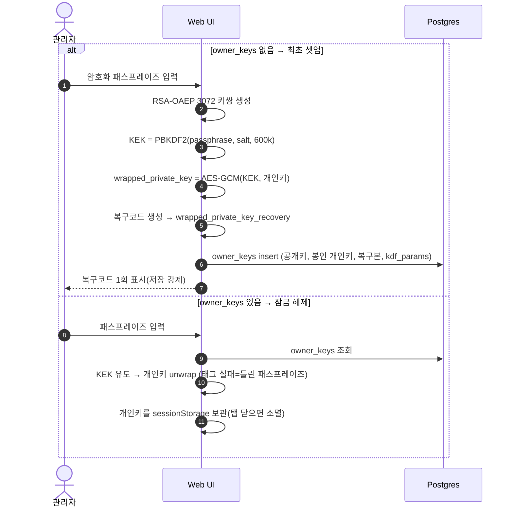

> 코드: `web/app.js:encSetupFlow / encUnlockFlow / ensureEncUnlocked`

---

## 3. 시나리오별 흐름

### S1. 설치 → 로그 적재 → 조회 (정상 end-to-end) ✅

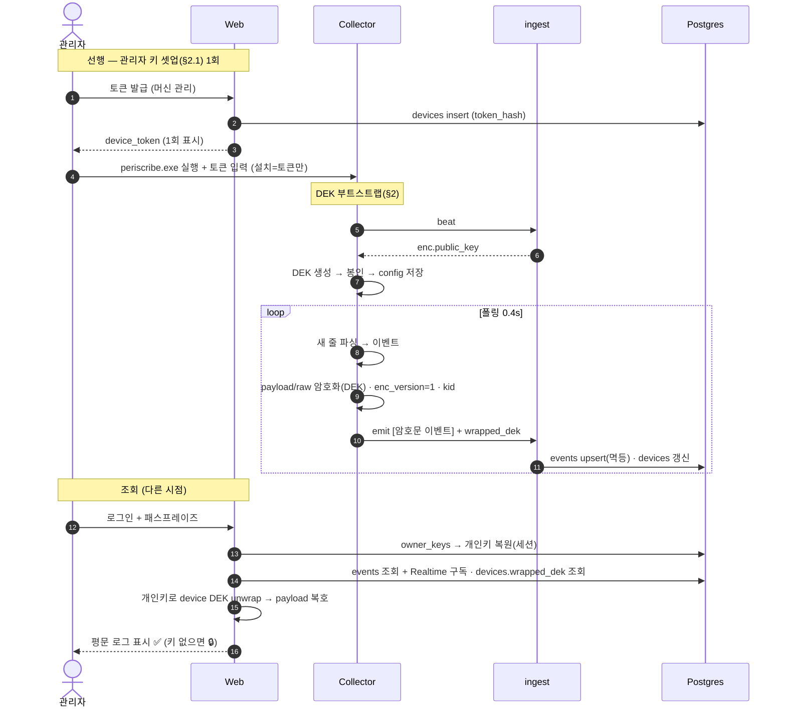

### S2. 컬렉터 재시작 (DEK 유지) ✅

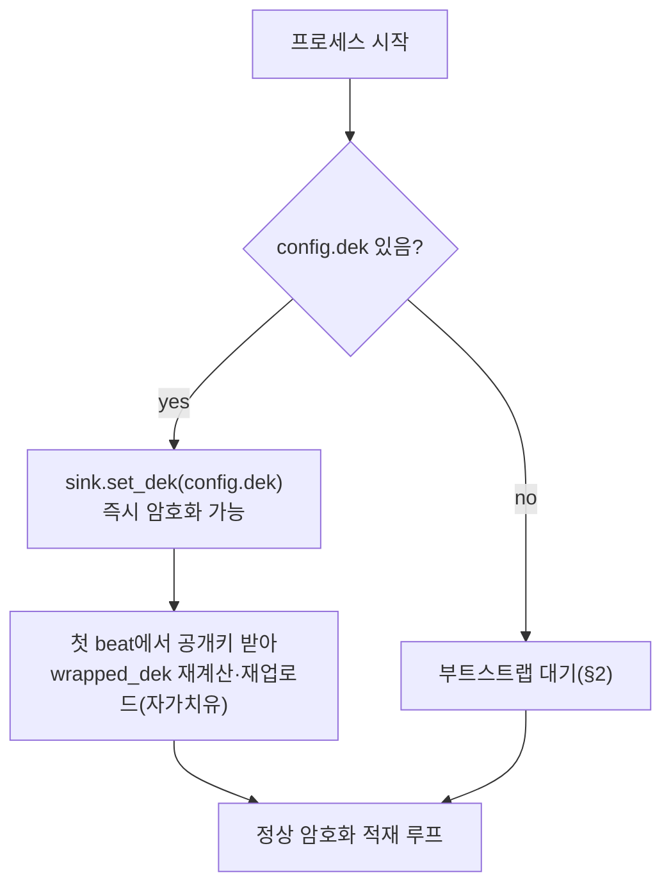

### S3. 암호화 키 대기 / 적재 보류 ✅

관리자가 아직 키를 안 만들었거나 네트워크 단절 시, **평문을 절대 올리지 않고** 보류한다.

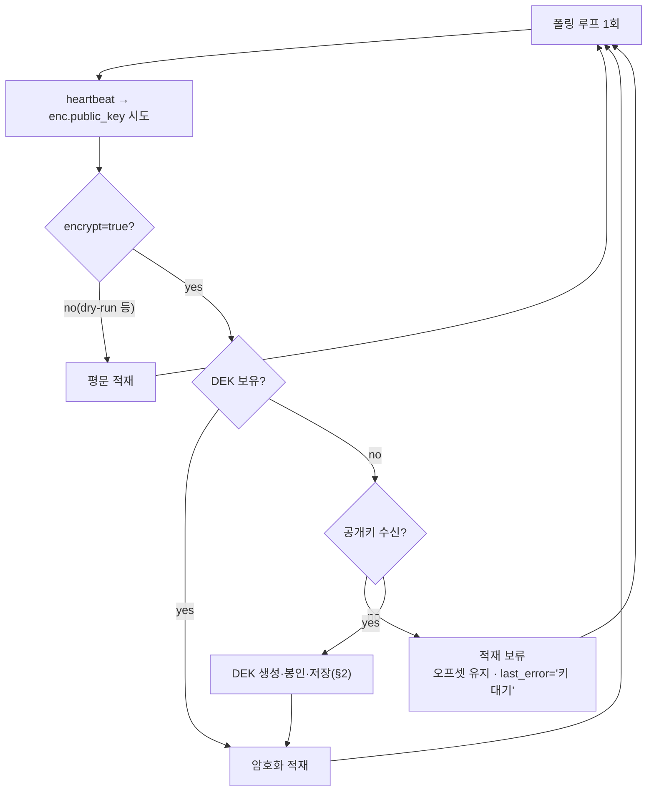

### S4. Revoke (관리자가 차단) ✅

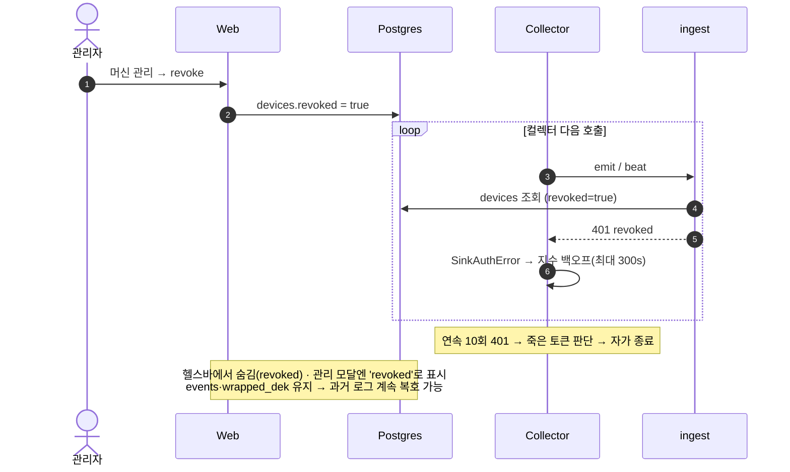

### S5. Uninstall (제거 신호 + 로컬 정리) ✅

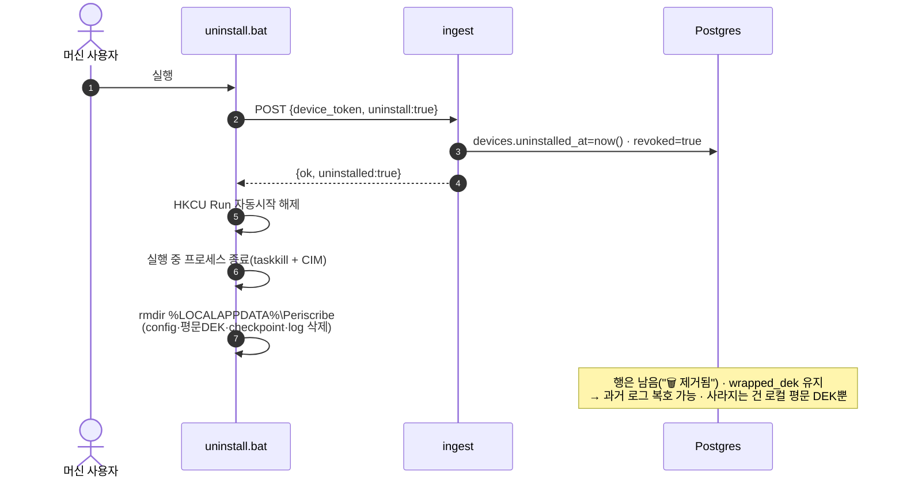

### S6. 디바이스 행 완전 삭제 (현재 동작) ✅ — ⚠ 데이터 접근 손실

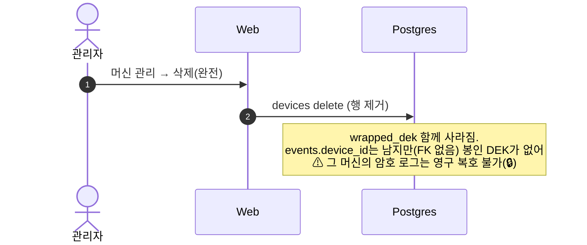

> 권장: E2EE에서 과거 로그를 보고 싶으면 **삭제 대신 revoke/제거됨 상태 유지**.

### S7. 재설치인데 machine_guid가 다를 때 (새 머신 취급) ✅

> 같은 머신이면 S8처럼 자동으로 한 디바이스로 합쳐진다. 아래는 **guid가 다른 경우**(OS 재설치/다른 PC/폴백 hostname 변경) — 새 디바이스로 잡힘.

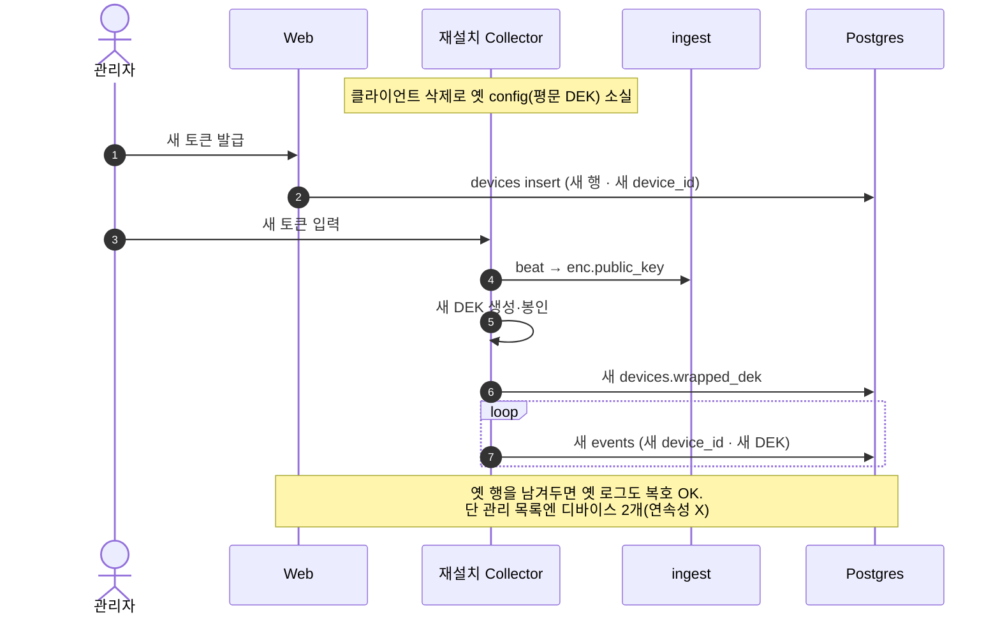

### S8. ✅ 디바이스 연속성 — machine_guid 자동 + DEK 키 히스토리

재설치해도 **같은 device 행**으로 자동 이어지고(관리자 매칭 불필요), 옛 로그도 계속 복호된다.
관리자는 **그냥 새 토큰 발급해서 그 머신에 꽂으면** 됨 — 같은 머신(machine_guid)이면 ingest가 알아서 합친다.

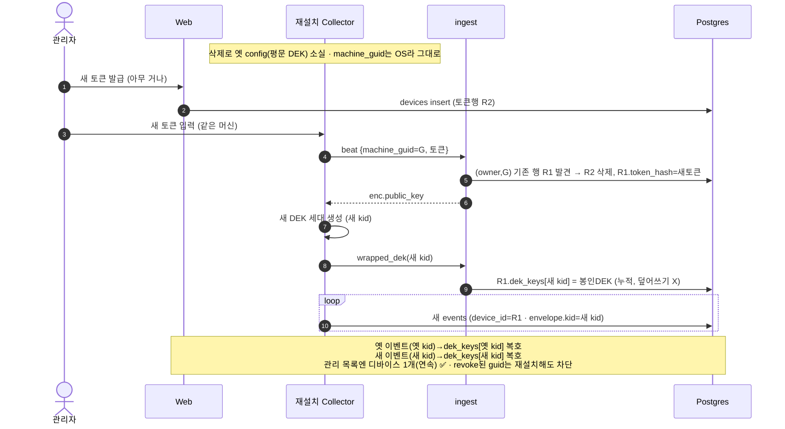

식별자: `machine_guid` = Windows 레지스트리 **MachineGuid**(설치마다 고유, 앱 재설치에도 유지, 폴백 hostname).
구현: `devices.machine_guid`·`dek_keys`(kid→봉인DEK) · ingest가 (owner,guid)로 머지 + dek_keys 누적 · 웹 복호는 `dek_keys[envelope.kid]` · 컬렉터는 부트스트랩마다 랜덤 kid.

---

## 4. 디바이스 수명주기 상태도

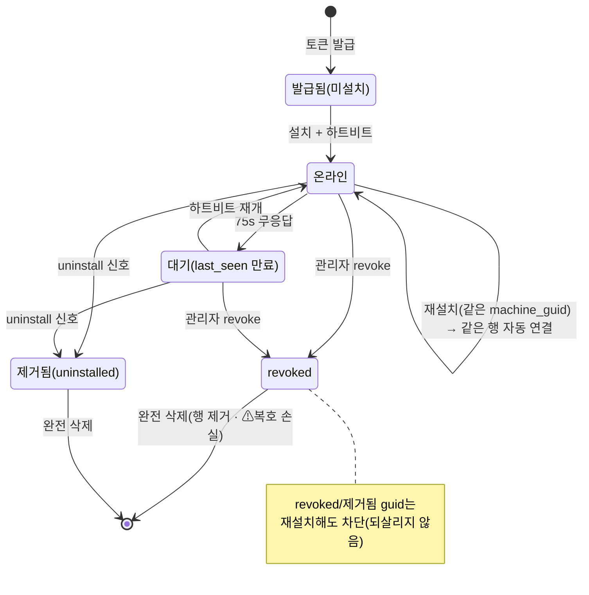

---

## 5. 데이터 모델 (ER)

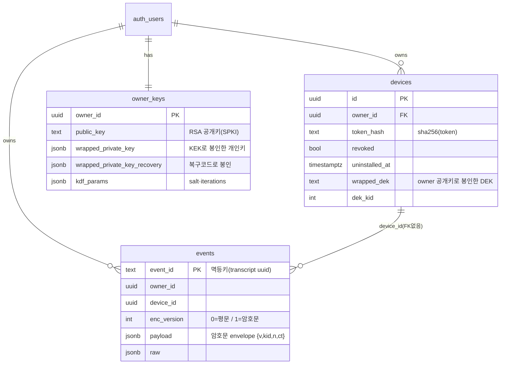

---

## 6. 암호화 경계 요약

| 자산 | 위치 | 운영자 접근 |
|---|---|---|
| 평문 payload | Collector 메모리 · 브라우저(복호 후) | ❌ |
| 평문 DEK | 머신 `config.json` (로컬) | ❌ |
| 봉인 DEK | `devices.wrapped_dek` | ⭕(암호문) — 개인키 없으면 무용 |
| owner 개인키 | 브라우저(복원, 세션) / DB(봉인본) | ❌ / ⭕(봉인본) |
| owner 공개키 | DB · 응답 | ⭕(비밀 아님) |
| 패스프레이즈 | 사람 머릿속 | ❌ |
| 메타데이터 | `events`(평문) | ⭕ |

⚠ 한계: 복호화 웹 JS를 운영자가 서빙 → *악의적* 운영자의 복호화-시점 키 탈취는 못 막음(at-rest 제로지식까지가 보장 범위). 상세는 `docs/E2EE-DESIGN.md` §7.
