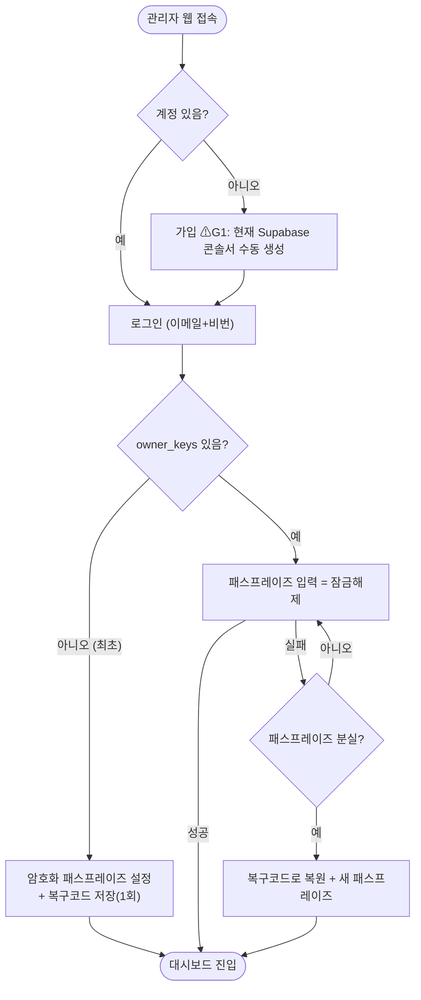
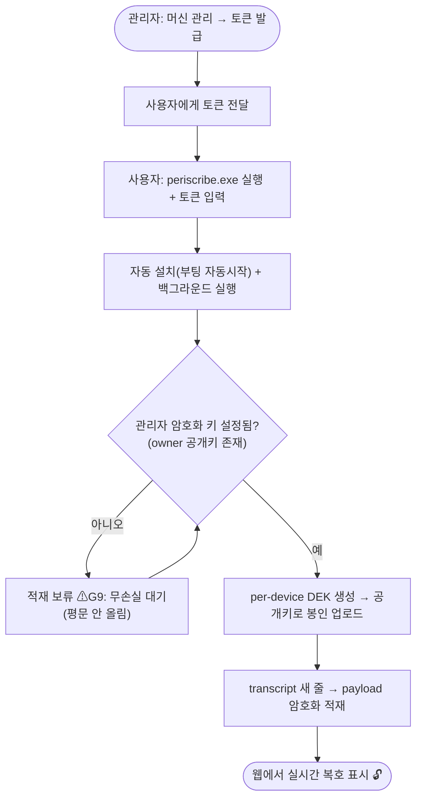
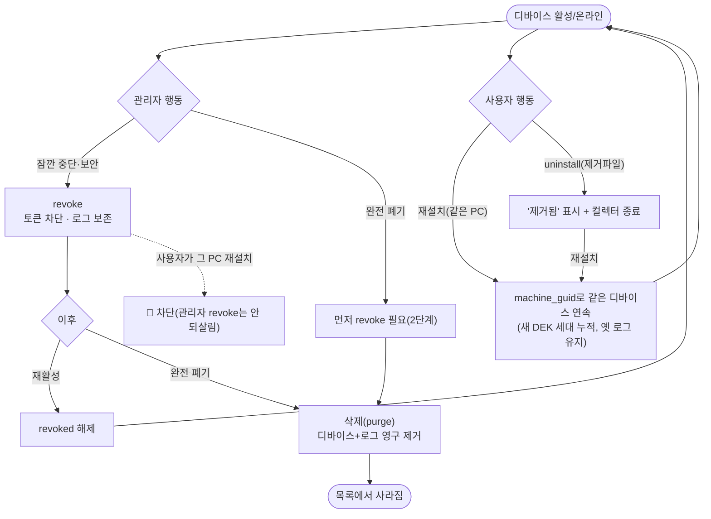
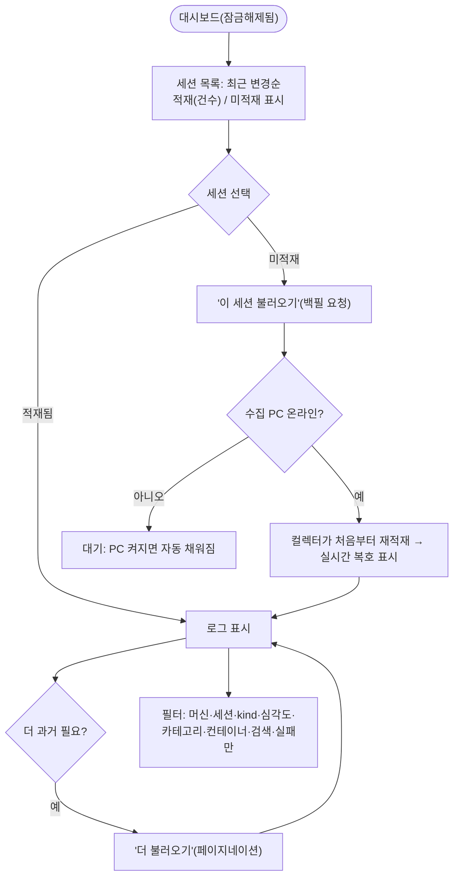
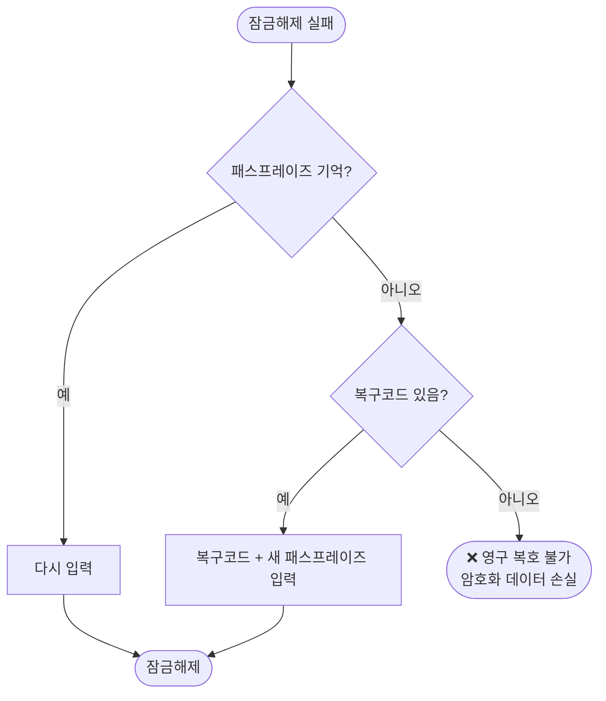
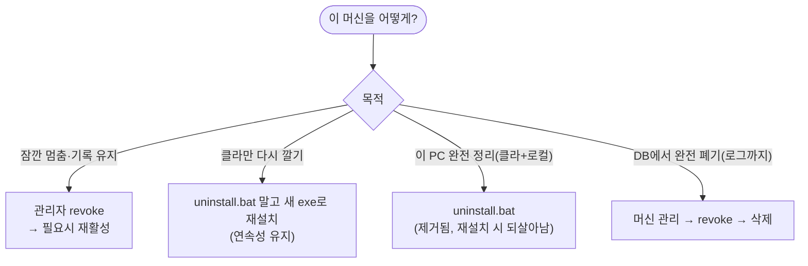

# Periscribe — 사용 시나리오 플로우차트

> 관리자/사용자 관점의 사용 흐름. Mermaid 플로우차트(GitHub·VS Code 렌더). 바로 보려면 `usage-flows.html`.
> ⚠ 표시 = 아직 커버 안 된 부분(GAP).

---

## F1. 관리자 온보딩 / 재방문

---

## F2. 머신 설치 → 수집 → 표시

---

## F3. 디바이스 수명주기 (관리자·사용자 행동 → 결과)

---

## F4. 로그 조회 / 과거 세션 불러오기

---

## F5. 패스프레이즈 분실 / 복구

---

## F6. 제거 vs 삭제 vs 차단 — 무엇을 쓸까

---

## 커버 안 된 부분(GAP) — 흐름상 위치

| GAP | 위치 | 심각도 |
|---|---|---|
| G1 회원가입 UI 없음 | F1 가입 | 높음(셀프서비스면) |
| G2 패스프레이즈 변경(아는 상태) UI 없음 | F1/F5 | 중 |
| G9 키 설정 전 설치 혼선(보류 안내 부족) | F2 보류 | 중(UX) |
| G4 transcript 삭제 시 카탈로그 잔재 | F4 목록 | 낮음 |
| G5 같은 토큰 2대 입력 | F2 설치 | 낮음 |
| G6 OS 재설치 시 옛 디바이스 잔존 | F3 | 낮음 |
| G8 크로스세션 삭제 미반영 | F3 삭제 | 낮음 |
